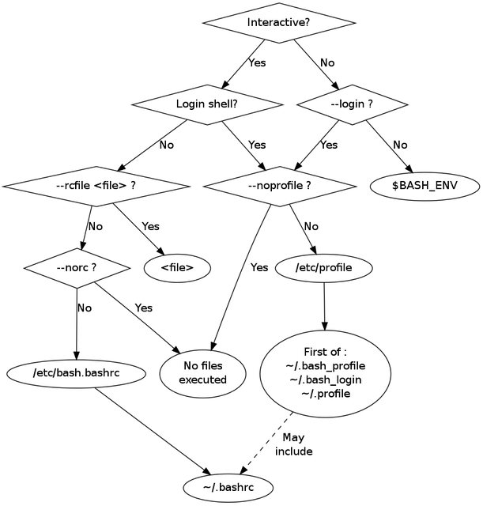

.. _conda-page:

*****************************************************************************
How can a conda environment be activated in docker or singularity containers?
*****************************************************************************

The `conda documentation <https://docs.conda.io/projects/conda/en/master/user-guide/tasks/manage-environments.html>`_ says that: *Activating environments is essential to making the software in the environments work well. Activation entails two primary functions: adding entries to PATH for the environment and running any activation scripts that the environment may contain. These activation scripts are how packages can set arbitrary environment variables that may be necessary for their operation*. Therefore, it is important to launch the command ``conda activate myTool_env``. 

This section describes how to activate a conda environment inside a container. First somes basics about shells are details to better understand how to write the docker and singularity recipes.

Properties of shells
====================

Before going any further, it is important to remind the basics of shell configurations and list of files it reads at start-up. In this section, we copy-pasted `Holger's Notes <https://hhoeflin.github.io/2020/08/19/bash-in-docker/>`_.

Type of shells
--------------

There are two properties that each shell has:

* it is either a `login` or a `non-login` shell 
* and as well as an `interactive` or `non-interactive shell`.

Login shells
************

A `login` shell is typically started when logging into a computer. In it, certain startup scripts are sourced that can be used to set the initial values for environment variables (e.g. PATH). A new bash shell can be explicitly turned into a login shell by using the ``-l`` or ``--login`` options.

Interactive shells
******************

An `interactive` shell is a shell that has its input, output and error streams connected to a terminal. This is typically the case when you start a shell inside another shell or when starting a shell in a docker container. The typical case of a `non-interactive` shell is a shell that is started in order to run a script. The option ``-i`` can be used to explicitly turn a shell into an interactive shell.

In addition to these option there are other switches that can be used to customize the behaviour which startup scripts get run and we will go over them and their effects later.

Configuration files
-------------------

There are a number of different configuration files that are sourced in different situations. Here is an overview of the ones relevant for ``bash``:

* ``/etc/profile``: This system-wide script is sourced by `login` shells at startup before any other files are sourced
* ``/etc/profile.d``: A system-wide directory from which additional scripts are sourced by `login` shells. While not formally listed in the GNU manual linked above, most distributions also read all scripts in this directory.
* ``~/.bash_profile``, ``~/.bash_login``, ``~/.profile``: These are scripts for individual users that are read by `login` shells. Only the first of these scripts that exists and is readable is used. If the option ``--noprofile`` is used, none of these scripts is sourced.
* ``/etc/bashrc`` or ``/etc/bash.bashrc``: A system-wide script that is sourced by `interactive` shells. CentOS uses ``/etc/bashrc`` whereas Debian-based systems use ``/etc/bash.bashrc``.
* ``~/.bashrc``: This user-specific script is sourced for all `interactive` shells. If the option ``--norc`` is used, this file is not being sourced. If the option ``--rcfile`` file is being used, file is sourced instead of ``~/.bashrc``.
* ``$BASH_ENV``: If a `non-interactive` shell is started and the environment variable ``BASH_ENV`` exists, then the script file referenced in ``BASH_ENV`` will be sourced.

The workflow is summarized in this `image <https://youngstone89.medium.com/unix-introduction-bash-startup-files-loading-order-562543ac12e9>`_:

Singularity
===========

It is important to remind the behaviour of singularity:

* singularity launches any ``bash`` with the ``--norc`` option. From ``man bash``, this option means: "Do not read and execute the system wide initialization file  ``/etc/bash.bashrc`` and  the  personal initialization file ``~/.bashrc`` if the shell is interactive". Note that this default behaviour of singularity can be changed if the ``SINGULARITY_SHELL`` environment variable is set to ``/bin/bash`` (but this is no recommended).

* Inside the ``%post`` section any file referred to as ``~/fileName`` or ``${HOME}/fileName`` is in ``/root`` inside the container as it is built with root privilege. This means that a standard user who launches a singularity image can never access such files. Therefore, if they are really needed by a standard user, they must be available elsewhere inside the image.

* All the command lines in the section ``%environment`` in the Definition file are written in the file ``/.singularity.d/env/90-environment.sh`` inside the singularity image. This file is execute at startup by singularity.

.. _conda-singularity-impossible:

Example1: impossible to activate the conda environment at startup
-----------------------------------------------------------------

Let's consider you run ``singularity build myTool.simg myTool.def`` from this ``myTool.def`` Definition file:

::

   Bootstrap: docker
   From: 4geniac/almalinux:8.4_conda-py39_4.10.3
   
   %environment
       export LC_ALL=en_US.utf-8
       export LANG=en_US.utf-8
   
   %post
       mkdir -p /opt/etc
       yum install -y which \
       && yum clean all \
       && conda create -y -n myTool_env  \
       && echo -e "#! /bin/bash\n\n# script to activate the conda environment" > ~/.bashrc \
       && conda init bash \
       && echo -e "\nconda activate myTool_env" >> ~/.bashrc \
       && echo "echo \"Hello World\"" >>  ~/.bashrc \
       && conda clean -a \
       && cp ~/.bashrc /opt/etc/bashrc

This way, the conda environment ``myTool_env`` is not activated at startup. Indeed, the file ``~/.bashrc`` will never be read by standard user and nothing says what to do with the file ``/opt/etc/bashrc``. In order to activate it, you explicitly need to type the command ``source /opt/etc/bashrc``:

::

   singularity  shell myTool.simg
   Singularity> conda env list
   base                  *  /usr/local
   myTool_env               /usr/local/envs/myTool_env
   
   Singularity> source /opt/etc/bashrc 
   Hello World
   (myTool_env) Singularity> conda env list
   base                     /usr/local
   myTool_env            *  /usr/local/envs/myTool_env

   (myTool_env) Singularity> 

The behaviour and outputs are the same if you run the following commands (note that the ``/bin/bash -c`` passed to singularity makes the shell `non-interactive`):

::

   singularity  exec myTool.simg /bin/bash -c 'conda env list; source /opt/etc/bashrc; conda env list'
   singularity  run myTool.simg /bin/bash -c 'conda env list; source /opt/etc/bashrc; conda env list'

.. _conda-singularity-noninteractive:

Example2: activate the conda environment at startup with 'singularity exec' or 'run'
------------------------------------------------------------------------------------

From the Definition file used in :ref:`conda-singularity-impossible`, add ``export BASH_ENV=/opt/etc/bashrc`` in the section ``%environment``. The ``myTool.def`` Definition file is now:

::

   Bootstrap: docker
   From: 4geniac/almalinux:8.4_conda-py39_4.10.3
   
   %environment
       export LC_ALL=en_US.utf-8
       export LANG=en_US.utf-8
       export BASH_ENV=/opt/etc/bashrc
   
   %post
       mkdir -p /opt/etc
       yum install -y which \
       && yum clean all \
       && conda create -y -n myTool_env  \
       && echo -e "#! /bin/bash\n\n# script to activate the conda environment" > ~/.bashrc \
       && conda init bash \
       && echo -e "\nconda activate myTool_env" >> ~/.bashrc \
       && echo "echo \"Hello World\"" >>  ~/.bashrc \
       && conda clean -a \
       && cp ~/.bashrc /opt/etc/bashrc

Using ``singularity exec``  or ``singularity run`` activate the conda environment ``myTool_env`` because they launch `non-interactive` shells which read and execute the file from the ``BASH_ENV`` environment variable:

::

   singularity  exec myTool.simg /bin/bash -c 'conda env list'
   Hello World
   base                     /usr/local
   myTool_env            *  /usr/local/envs/myTool_env

   singularity  exec myTool.simg /bin/bash -c 'conda env list'
   Hello World
   base                     /usr/local
   myTool_env            *  /usr/local/envs/myTool_env

However, ``singularity shell`` launch an `interactive` shell thus ignoring the ``BASH_ENV`` environment variable. The conda environment ``myTool_env`` is therefore not activated:

::

   singularity  shell myTool.simg
   Singularity> conda env list
   base                  *  /usr/local
   myTool_env               /usr/local/envs/myTool_env
   
   Singularity> source /opt/etc/bashrc 
   Hello World
   (myTool_env) Singularity> conda env list
   base                     /usr/local
   myTool_env            *  /usr/local/envs/myTool_env

   (myTool_env) Singularity> 

.. _conda-singularity-all:

Example3: activation of the conda environment
---------------------------------------------

From the Definition file used in :ref:`conda-singularity-impossible`, add ``source /opt/etc/bashrc`` in the section ``%environment``. The ``myTool.def`` Definition file is now:

::

   Bootstrap: docker
   From: 4geniac/almalinux:8.4_conda-py39_4.10.3
   
   %environment
       export LC_ALL=en_US.utf-8
       export LANG=en_US.utf-8
       source /opt/etc/bashrc
   
   %post
       mkdir -p /opt/etc
       yum install -y which \
       && yum clean all \
       && conda create -y -n myTool_env  \
       && echo -e "#! /bin/bash\n\n# script to activate the conda environment" > ~/.bashrc \
       && conda init bash \
       && echo -e "\nconda activate myTool_env" >> ~/.bashrc \
       && echo "echo \"Hello World\"" >>  ~/.bashrc \
       && conda clean -a \
       && cp ~/.bashrc /opt/etc/bashrc

As the section ``%environment`` is copied inside the singularity image in the file, and since this file is executed by singularity anytime a shell is started, the conda environment ``myTool_env`` is thus activated by default at singularity startup:

::

   singularity shell myTool.simg 
   Hello World
   Singularity myTool.simg:~> conda env list
   base                     /usr/local
   myTool_env            *  /usr/local/envs/myTool_env
   
   Singularity myTool.simg:~>

::

   singularity  run  myTool.simg /bin/bash -c 'conda env list'
   singularity  exec  myTool.simg /bin/bash -c 'conda env list'
   Hello World
   base                     /usr/local
   myTool_env            *  /usr/local/envs/myTool_env

::

   singularity  exec  myTool.simg /bin/bash -c 'conda env list'
   Hello World
   base                     /usr/local
   myTool_env            *  /usr/local/envs/myTool_env

Docker
======

It is important to remind the behaviour of Docker:

* Docker is run with root privilege. All the files created inside the container such as  ``~/fileName`` or ``${HOME}/fileName`` are in ``/root`` inside the container. These files will be available when the container is run.

Example1
--------

Let's consider you run ``sudo docker build  -f myToolV0.Dockerfile -t mytool .`` from this ``myTool.Dockerfile``:

::

   FROM 4geniac/almalinux:8.4_conda-py39_4.10.3
   
   # install conda env
   RUN yum install -y which \
   && yum clean all \
   && conda create -y -n myTool_env  \
   && echo -e "#! /bin/bash\n\n# script to activate the conda environment" > ~/.bashrc \
   && conda init bash \
   && echo -e "\nconda activate myTool_env" >> ~/.bashrc \
   && echo "echo \"Hello World\"" >>  ~/.bashrc \
   && conda clean -a
   
   # environment variables
   ENV LC_ALL en_US.utf-8
   ENV LANG en_US.utf-8
   ENV BASH_ENV ~/.bashrc

The following ``docker run`` options will start an `interactive` shell, the root user will have access to the ``~/.bashrc`` file inside the container, this file will be sourced by the shell. Therefore, the conda environment ``myTool_env`` is activated:

::

   sudo docker run -it mytool
   Hello World
   (myTool_env) bash-4.2# conda env list
   base                     /usr/local
   myTool_env            *  /usr/local/envs/myTool_env
   

However, if ``docker run`` uses the following options, it will start an `non-interactive` shell. Therefore, the ``~/.bashrc`` is not sourced and the conda environment ``myTool_env`` is not activated:

::
   
   sudo docker run -i  --entrypoint /bin/bash mytool -c 'eval conda env list'
   base                  *  /usr/local
   myTool_env               /usr/local/envs/myTool_env

.. _conda-docker-noninteractive:

Example2
--------

Let's add ``ENV BASH_ENV ~/.bashrc`` in the Dockerfile and set the ``PS1`` variable (otherwise the shell will complain about unbound variable) as follows:

::

   FROM 4geniac/almalinux:8.4_conda-py39_4.10.3
   
   # install conda env
   RUN yum install -y which \
   && yum clean all \
   && conda create -y -n myTool_env  \
   && echo -e "#! /bin/bash\n\n# script to activate the conda environment" > ~/.bashrc \
   && echo "export PS1='Docker> '" >> ~/.bashrc \
   && conda init bash \
   && echo -e "\nconda activate myTool_env" >> ~/.bashrc \
   && echo "echo \"Hello World\"" >>  ~/.bashrc \
   && conda clean -a
   
   # environment variables
   ENV LC_ALL en_US.utf-8
   ENV LANG en_US.utf-8
   ENV BASH_ENV ~/.bashrc
   
::
   
   sudo docker run -i  --entrypoint /bin/bash mytool -c 'eval conda env list'
   base                     /usr/local
   myTool_env            *  /usr/local/envs/myTool_env

Application to nextflow
=======================

When running inside singularity, nextflow uses a command line similar to:

::

   singularity  exec  myTool.simg /bin/bash -c 'conda env list'

Therefore, the Definition file must be written as explained in:

* :ref:`conda-singularity-noninteractive`, or
* :ref:`conda-singularity-all` if the conda environment ``myTool_env`` must be also activated by default with ``singularity shell`` (we recommend this solution).

When running inside docker, nextflow uses a command line similar to:

::

   sudo docker run -i  --entrypoint /bin/bash mytool -c 'eval conda env list'

Therefore, the Dockerfile must be written as explained in :ref:`conda-docker-noninteractive`.
