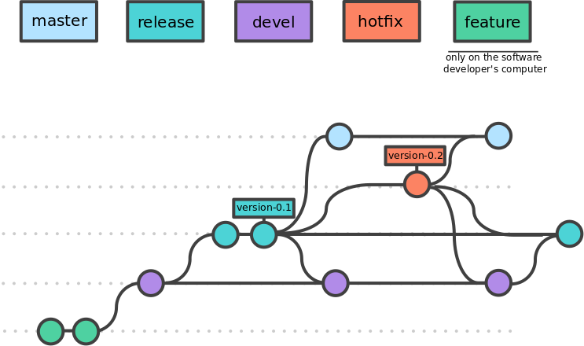

.. _devcycle-page:

*****************
Development cycle
*****************

Prototyping
===========

First, configure your repository as explained here: :ref:`install-configure-file`. In general, this has to be done only once unless you want to change the options.

When prototyping the pipeline, we advice to use the :ref:`run-profile-multiconda` profile. As this stage, the containers should not be available thus making impossible to use the :ref:`run-profile-singularity` or :ref:`run-profile-docker` profiles.

We suggest that you provide test data and a ``conf/test.config`` file such that the pipeline can be tested on any modification of the source code for validation. Whenever possible, the test data must be as small as possible such that running the test does not take too much time.

Then, to install and test your modifications, just type ``make test_multiconda`` (see :ref:`install-test`) in the build directory. The first time this command is typed, the ``config`` files are automatically generated and installed. The configuration files will be regenerated whenever you modify the ``conf/base.config`` file (or whenever something is added or modified the both the ``recipes`` or ``modules`` directories).

.. note::

   You can combine both the :ref:`run-profile-multiconda` with the :ref:`run-profile-path` profiles as described in the :ref:`run-combine-path-conda` section. This offers the possibility to install on your own all the software you need to setup the analysis methodology for the pipeline you are developing, in particular whenever you fall in any of the cases |ko| of |path| as described in the  :ref:`run-process-profile-table` table.

If you don't want any test to be started, just type ``make install``.

Whatever you use ``make test_multiconda`` (or any custom targets available in :ref:`install-test`) or ``make install``, only the files that have been modified will be installed that allows this step to be just a quick copy of the modified files in the install directory (if it is not necessary to generate the  ``config`` files).

.. important::

   **Why it is essential to deploy the pipeline in a dedicated directory and then test your modifications** rather than testing it directly from your source code directory in which you are developing?
   
   The deployement of the pipeline in a dedicated directory makes it possible to keep developing and modifying any file or to checkout any branch while a test is running especially when the test can take time. If you would launch a test from the source code directory the files could be modified while the test is running.

.. note::

   If you really prefer to launch your test in your source code directory (for good or bad reasons) you can still do it. In this case, you can either write and add the config files for the nextflow :ref:`run-profiles` as described in :ref:`profiles-page`  in the ``conf`` directory of copy them from config files automatically generated.

Containerizing
==============

Building the `singularity <https://sylabs.io/singularity/>`_ or `docker <https://www.docker.com/>`_ containers should start once the prototyping is over. Thus, the software developers will take care of:

* writing the recipes for any process that have a label falling in the :ref:`process-source-code` or :ref:`process-custom-install` categories,
* performing :ref:`process-resource` in order to optimize the informatic resource asked by the different processes.

Deployement
===========

Whoever you are, follow the guidelines describes in the :ref:`install-page` section.

Git
===

Refer to the `git <https://git-scm.com/>`_ documentation for details.

Branching strategy
------------------
Pour assurer la gestion de versions des développements, nous allons utiliser dans git différentes **branches**, chacune correspondant à une finalité bien précise. Le modèle que nous utilisons est le suivant:

* le **dépôt central** contient 4 branches:

	* **devel**: correspond à la version courante de développement. Notons que la version courante **n'est pas forcément** celle qui est installée dans l'environnement de **dev**.

    * **release**: correspond à la version candidate qui a pour vocation à passer en production, une fois que les tests opérationnels et les tests d'acceptation sont concluants. Autrement dit, la branche **release** est la version de pré-production. La branche **release** provient de la branche **devel**.

	* **hotfix**: en cas de survenue d'une anomalie critique dans l'environnement de production, cette branche sera utilisée pour développer les correctifs nécessaires.
	
    * **master**: correspond à **l'archivage** des versions qui ont été déployées en production. Aucun développement, donc aucun commit n'est fait sur cette branche.

Parmi ces quatre branches, les branches **release**, **master** et **hotfix** sont des branches protégées, cela signifie que seuls les utilisateurs qui disposent du rôle **Master** dans gitlab pourront faire un push sur ces branches du dépôt distant. Les modifications sur ces branches par les autres utilisateurs passeront par un **Merge request**.

* le **répertoire local de travail** contient:

    * les 4 branches ci-dessus,

    * des branches propres que le développeur a créées pour réaliser ses développements. Ces branches n'ont pas vocation à être connues par le dépôt central.  Ces branches propres de travail seront nommées **feature** (le terme feature pourra être remplacé par un nom plus explicite).
	
	* des branches que le développeur a créées pour des **Merge Request** sur les branches protégées.

We recommend to use the following branches:

* devel
* release
* hotfix (if needed)
* master

|gitworkflow|

Tag strategy
------------

For official release that can be used in a production environnement, use a tag with the prefix **version-**.

.. warning::

   This is essential that you use this naming convention. Indeed, this will allow the display of a message if a user runs a pipeline with a development version that can be unstable and thus providing results that are not reliable.

